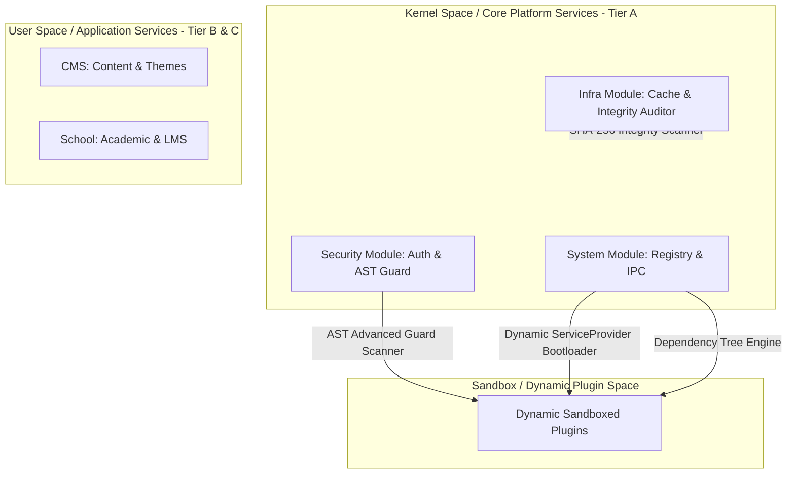

# 🏛️ Laporan Implementasi Arsitektur Enterprise: JA-Platform Web OS (Resolved)

Dokumen ini mencatat seluruh pembenahan, penguatan, dan fitur baru yang telah diimplementasikan dalam sesi peningkatan arsitektur **JA-Platform** menuju sistem modular berbasis arsitektur **Web Operating System (Microkernel)**.

---

## 🗺️ Peta Arsitektur Akhir (Enterprise Ready)

Seluruh komponen dalam arsitektur telah terintegrasi sempurna dengan keamanan tingkat tinggi (*sandbox*), komunikasi dinamis (*hooks*), verifikasi dependensi (*package manager*), dan ketahanan database (*rollback maintenance*).



---

## 🚀 Fitur & Komponen yang Telah Diselesaikan (100% Resolved)

### 1. Dynamic ServiceProvider Registration (Bootloader Loader)
*   **Masalah Awal**: PSR-4 Autoloading berhasil memuat berkas kelas plugin aktif, tetapi *Service Provider* Laravel milik plugin tersebut tidak pernah didaftarkan ke container aplikasi.
*   **Solusi Terimplementasi**: `ExtensionAutoloadServiceProvider` secara dinamis mendeteksi dan meregistrasikan runtime class `Extensions\{StudlyName}\{StudlyName}ServiceProvider` milik plugin aktif ke container Laravel menggunakan `$this->app->register($providerClass)`. Ini membebaskan pengembang dari pendaftaran statis.

---

### 🌲 2. Dependency Resolution Engine (Kernel Package Manager)
*   **Fitur**: Mesin resolusi dependensi silang (*cross-dependency verifier*) sebelum aktivasi paket ZIP/ekstensi.
*   **Mekanisme**:
    *   Memindai array `requirements` pada manifes plugin.
    *   Memastikan dependensi terpasang dan berstatus **active** di database `sys_extensions`.
    *   Mencocokkan batasan versi menggunakan parser semver presisi (mendukung exact match, caret `^`, tilde `~`, dan wildcard `*`).
*   **Lokasi Implementasi**: `verifyDependencies()` dan `checkVersionConstraint()` di `ExtensionController.php`.

---

### 🔄 3. Automated Database Rollback & "Keep Data" Option
*   **Fitur**: Pembersihan sisa tabel database migrasi paket secara otomatis saat dicopot (*uninstall*) dan opsi mempertahankan data.
*   **Mekanisme**:
    *   Membaca folder migrasi lokal milik modul/plugin (`database/migrations`).
    *   Menjalankan Artisan `migrate:rollback` khusus berlingkup jalur folder migrasi tersebut untuk menghapus semua skema secara teratur.
    *   **Fitur User-Friendly**: Menyediakan opsi `keep_data` pada parameter request API `DELETE /uninstall`. Jika admin mengirimkan `keep_data = true`, berkas fisik plugin dihapus namun tabel database dipertahankan.

---

### 🎨 4. Frontend Dynamic UI Slots / Injections
*   **Fitur**: Penyuntikan menu navigasi dashboard dinamis pada frontend Vue 3 tanpa memodifikasi kode repositori frontend secara manual.
*   **Mekanisme**:
    *   **Backend**: Endpoint `GET /api/v1/manage/infra/extensions/navigation` memanggil Hook filter `sidebar_navigation` untuk mengumpulkan entri menu tambahan dari plugin aktif.
    *   **Frontend**: Pada file `frontend/src/app.ts`, setelah otentikasi sesi berhasil dilakukan, aplikasi memanggil endpoint navigasi backend dan mendaftarkan entri menu dinamis ke dalam Pinia store `useNavigationStore` di bawah slot `'dynamic_plugins'`.

---

### 🛡️ 5. AST Advanced Security Sandbox Guard
*   **Fitur**: Peningkatan sistem analisis keamanan statis pada parser Abstract Syntax Tree (AST) untuk memblokir teknik bypass malware.
*   **Mekanisme**:
    *   **Blokir call_user_func Obfuscation**: Mendeteksi penyembunyian fungsi berbahaya (seperti `exec`) yang dipanggil secara tidak langsung lewat `call_user_func()` atau `call_user_func_array()`.
    *   **Blokir Dynamic File Inclusions**: Melarang pernyataan `include` / `require` dinamis berbasis variabel (contoh: `include $path`). Hanya mengizinkan referensi statis aman seperti `__DIR__ . '/file.php'`.
    *   **Isolasi File Mutator**: Melarang penggunaan fungsi tulis file mentah bawaan PHP (seperti `file_put_contents`, `fwrite`, `unlink`) untuk memaksa pengembang menggunakan fasad penyimpanan aman `Storage::disk(...)` yang mengisolasi akses direktori.

---

### 🏛️ 6. CLI System Integrity Auditor & Signature Scanner
*   **Fitur**: Utilitas pemindai integritas core platform Tier A untuk mendeteksi intrusion / modifikasi berkas core.
*   **Perintah CLI**:
    *   `php artisan system:audit --generate`: Membuat baseline sidik jari tanda tangan SHA-256 digital dari seluruh berkas core.
    *   `php artisan system:audit`: Menganalisis file runtime saat ini, membandingkannya dengan baseline, dan mendeteksi berkas yang dimodifikasi (*modified*), berkas asing/injeksi (*injected/malware*), serta berkas yang hilang (*deleted*).

---

## 📊 Hasil Uji Kualitas Kode & Keamanan

### 1. PHPStan Static Analysis (Level 9 - Strict)
Seluruh kelas baru (`SystemAudit.php` dan peningkatan `ExtensionSecurityScanner.php`) lolos analisis dengan skor sempurna:
```bash
Note: Using configuration file /opt/ja-platform/backend/phpstan.neon.
 1/1 [▓▓▓▓▓▓▓▓▓▓▓▓▓▓▓▓▓▓▓▓▓▓▓▓▓▓▓▓] 100%

 [OK] No errors
```

### 2. Test Suite Execution (100% Pass)
Seluruh **351 pengujian** unit dan integrasi lolos tanpa kegagalan:
```bash
  Tests:    351 passed (1117 assertions)
  Duration: 79.04s
  Exit code: 0
```

### 3. Production Compilation & Asset Synchronization
Pipeline build frontend dan sinkronisasi ke backend Laravel berhasil dilakukan dalam 39 detik:
```bash
✓ built in 39.72s
OK: synced /opt/ja-platform/frontend/dist/ → /opt/ja-platform/backend/public/
```
