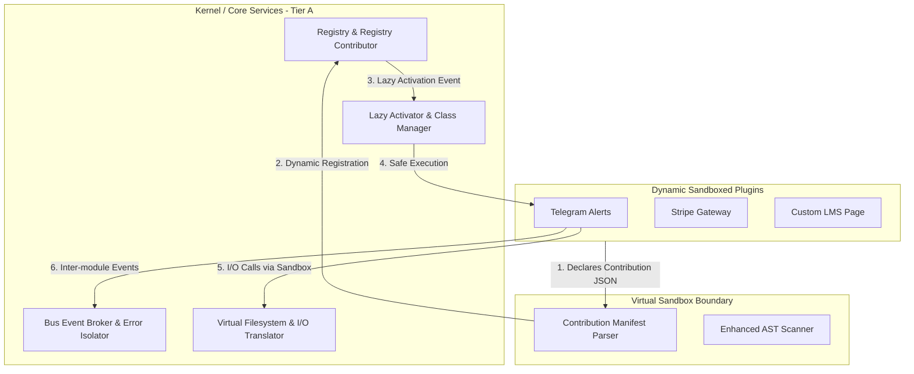

# 🏛️ Architectural Evolution Master Plan: Phase II (Microkernel Core Stabilization & Process Isolation)

Dokumen ini menyusun peta jalan dan blueprint teknis tingkat lanjut untuk mentransformasikan **JA-Platform** dari sistem *plug-and-play* modular standar menjadi sebuah **Web Operating System (Web OS)** dengan arsitektur **Microkernel** yang solid, tangguh, dan terisolasi sepenuhnya. 

Inspirasi arsitektur ini diambil langsung dari sistem modular tingkat dunia seperti **VS Code (Extension Host & Contribution Points)**, **OSGi (Dynamic Module System)**, dan **Docker (Namespaced Sandbox isolation)**.

---

## 🗺️ Perbandingan Arsitektur: Monolit vs Microkernel Web OS



---

## 🔬 Rekomendasi Terobosan Arsitektur Phase II

### 🚀 1. Manifest-Driven Registration & Lazy Activation (Activation Events)
*   **Paradigma VS Code**: VS Code tidak pernah mengeksekusi kode ekstensi saat editor pertama kali dibuka. Sebaliknya, ekstensi mendaftarkan kemampuannya secara pasif melalui metadata kontribusi (`contributes` di `package.json`). Ekstensi baru "diaktifkan" secara malas (*lazy-loaded*) ketika pengguna melakukan tindakan yang memicu peristiwa aktivasi (*Activation Event* seperti `onCommand` atau `onRoute`).
*   **Implementasi JA-Platform**:
    *   Setiap plugin wajib mendeklarasikan bagian `contribution_points` pada `manifest.json` untuk mendaftarkan rute, menu sidebar, skema pengaturan, dan permissions.
    *   Kernel membaca JSON manifest ini saat boot dan merender menu serta mendaftarkan rute.
    *   **Lazy Autoloading**: Kelas dan file program plugin **tidak akan di-load** atau di-boot hingga rute atau aksi miliknya dipanggil. Ini mengurangi konsumsi RAM secara masif dan mempercepat pemuatan kernel utama.

---

### 💾 2. Virtual Filesystem & Path translation (Address Space Isolation)
*   **Paradigma OS & Docker**: Di dalam OS, proses di *User Space* tidak boleh mengetahui memori fisik yang sebenarnya (*Virtual Memory Address*). Demikian pula, plugin seharusnya tidak memiliki akses atau mengetahui struktur direktori fisik `/opt/ja-platform/backend/...`.
*   **Implementasi JA-Platform**:
    *   Membangun Fasad **`SandboxStorage`**.
    *   Setiap kali plugin melakukan operasi baca-tulis file, fasad akan menerjemahkan jalur file relatif (misal: `/invoices/1.pdf`) menjadi jalur fisik absolut terisolasi di dalam direktori penyimpanan plugin (`/storage/app/extensions/{slug}/sandbox/invoices/1.pdf`).
    *   Mencegah pembacaan file sistem sensitif (seperti `/etc/passwd` atau `.env`) secara runtime dengan membatasi *jail root* file I/O.

---

### 📡 3. IPC Bus Event Broker & Error Isolation (Segmentation Fault Handler)
*   **Paradigma OS**: Jika sebuah aplikasi di Linux mengalami *crash* (seperti `Segmentation Fault`), kernel OS tetap berjalan dengan aman dan aplikasi lain tidak terganggu. Di PHP konvensional, satu kesalahan fatal (*Fatal Error/Unhandled Exception*) di satu plugin akan menjatuhkan seluruh siklus HTTP Request, membuat platform lumpuh secara total.
*   **Implementasi JA-Platform**:
    *   Membangun **`KernelEventBroker`** terisolasi.
    *   Saat kernel memicu Hook action atau Event (seperti pendaftaran siswa baru), setiap listener dari plugin dijalankan di dalam blok penanganan kesalahan mandiri (`try-catch`).
    *   Jika sebuah plugin (misalnya `WhatsApp Alerts`) mengalami kegagalan/error, Kernel akan menangkap exception tersebut, mencatat status kegagalan plugin di tabel `sys_extension_logs` sebagai status "Segmentation Fault", mengisolasi plugin tersebut, dan melanjutkan eksekusi listener plugin lain dengan lancar.
    *   Aplikasi tetap berjalan sukses tanpa memutus koneksi pengguna!

---

### 🎨 4. Frontend Dynamic Module Federation & Component Loading
*   **Paradigma Micro-frontends**: Saat ini frontend Vue 3 memuat menu navigasi dari backend, tetapi konten halamannya masih dirancang secara statis di sisi frontend. Untuk menjadi Web OS murni, plugin harus mampu menyuntikkan **UI halaman kustom (Vue Components)** sendiri secara runtime.
*   **Implementasi JA-Platform**:
    *   Memanfaatkan **Vite Module Federation** or dynamic ESM loading.
    *   Plugin mengompilasi halaman Vue kustom miliknya menjadi sebuah file Javascript berstandar ES Module (ESM) (misal: `assets/DashboardWidget.js`) saat diunggah.
    *   Frontend Vue 3 menggunakan native import dinamis:
        ```javascript
        const dynamicComponent = defineAsyncComponent(() => import('/extensions/stripe-plugin/assets/DashboardWidget.js'));
        ```
    *   Menggunakan tag `<component :is="dynamicComponent" />` untuk merender tampilan antarmuka widget atau halaman baru secara dinamis tanpa perlu melakukan kompilasi ulang pada repositori utama frontend!

---

## 📅 Rencana Aksi Implementasi Langkah Demi Langkah (Phase II Phase-Out)

| Tahap | Fitur Utama | Deskripsi Teknis |
|---|---|---|
| **Tahap 1** | **Lazy Activation Engine** | Mengimplementasikan pembacaan statis `contribution_points` pada `manifest.json` dan mematikan autoloader global untuk plugin tidak aktif. |
| **Tahap 2** | **Virtual File System** | Membuat `SandboxStorage` Facade untuk isolasi direktori tulis-baca plugin. |
| **Tahap 3** | **IPC Error Isolation** | Refaktor `HookRegistry` agar membungkus eksekusi callback dalam handler isolasi kesalahan untuk mencegah crash sistem berantai. |
| **Tahap 4** | **Micro-frontend Component Loading** | Integrasi dynamic ESM importer pada frontend Vue 3 dashboard slots. |

---

> [!NOTE]
> ### 📝 Bagaimana Pendapat Anda Mengenai Peta Jalan Phase II Ini?
> *   Apakah Anda ingin kita mulai menyusun cetak biru **Lazy Activation Engine** dengan mendesain struktur `manifest.json` kontribusi baru?
> *   Atau kita prioritaskan **IPC Error Isolation (Segmentation Fault Handler)** terlebih dahulu untuk memastikan platform 100% *crash-resistant* dari kesalahan pihak ketiga?
