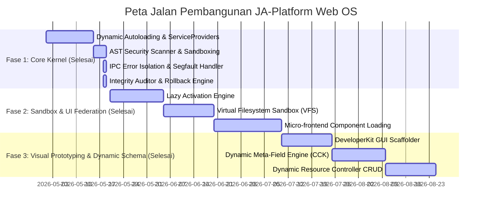

# 🏛️ JA-Platform Web OS: Master Blueprint & Evolutionary Roadmap

Dokumen ini adalah cetak biru (**Master Blueprint**) utama dan rencana aksi berfase (**Evolutionary Roadmap**) untuk mentransformasikan **JA-Platform** menjadi sebuah **Web Application Operating System** berstandar enterprise yang aman, terisolasi secara modular, dan memiliki fleksibilitas luar biasa tinggi.

---

## 🗺️ Peta Jalan Evolusi 3 Fase (Evolutionary Roadmap)

---

## 🎯 Detail Fase Pembangunan & Arsitektur Teknis

### 🟢 FASE 1: Core Kernel Integrity & Fault Tolerance (Status: 100% SELESAI)
Fase ini berfokus pada pembangunan pondasi kokoh dari mikro-kernel, gerbang keamanan statis, dan isolasi *thread request* runtime.

*   **1.1 Dynamic ServiceProvider Autoloader**:
    *   Mendaftarkan secara dinamis *Service Providers* milik plugin/modul aktif to container Laravel saat booting.
*   **1.2 AST Security Sandbox Scanner**:
    *   Pemindaian statis Abstract Syntax Tree sebelum plugin diaktifkan.
    *   Memblokir pemanggilan fungsi sensitif terselubung (`call_user_func`), *Dynamic File Inclusions* berbahaya, dan mutasi file sistem mentah tanpa isolasi direktori.
*   **1.3 IPC Event Broker & Error Isolation (Segfault Handler)**:
    *   Membungkus pemanggilan callback plugin di Hook/Events dalam *try-catch isolation boundary*.
    *   Kegagalan atau crash satu plugin akan diisolasi menggunakan `HookCrashToken` tanpa menjatuhkan alur utama HTTP request kernel.
*   **1.4 Dependency Tree Resolution Engine**:
    *   Memverifikasi manifes kebutuhan antar-plugin menggunakan parser batasan versi SemVer.
*   **1.5 Automated Database Rollback & Keep Data Option**:
    *   Rollback skema database modul terarah saat uninstalasi, dengan pilihan mempertahankan data tabel (`keep_data=true`).
*   **1.6 CLI System Integrity Auditor**:
    *   Perintah Artisan `system:audit` untuk membandingkan tanda tangan SHA-256 berkas core Tier A runtime terhadap baseline resmi rilis.

---

### 🟢 FASE 2: Core Sandbox Scoping & UI Federation (Status: 100% SELESAI)
Fase ini bertujuan membatasi ruang alamat fisik data (*virtual memory address*) dan mendelegasikan kemudahan kontribusi visual plugin secara runtime.

*   **2.1 Lazy Activation Engine (Activation Events)**:
    *   Mewajibkan bagian `contribution_points` pada `manifest.json` plugin untuk mendaftarkan rute, menu, dan pengaturan secara statis.
    *   Kernel membaca kemampuannya secara pasif tanpa me-load file PHP plugin. Plugin baru diaktifkan secara malas (*lazy-loaded*) saat *Activation Event* (seperti akses rute) dipicu.
*   **2.2 Virtual Filesystem Sandbox (VFS - SandboxStorage)**:
    *   Meluncurkan Fasad `SandboxStorage` untuk mengisolasi operasi baca-tulis file plugin.
    *   Setiap path relatif (misal: `/logs/output.txt`) otomatis diterjemahkan menjadi path fisik absolut terisolasi `/storage/app/extensions/{slug}/sandbox/logs/output.txt`.
*   **2.3 Micro-frontend Component Federation (Vite Dynamic ESM)**:
    *   Mendukung kompilasi halaman kustom plugin menjadi ES Modules (`.js`).
    *   Dashboard utama memuat berkas JS kustom secara dinamis dari folder plugin dan merendernya secara runtime menggunakan tag Vue 3 `<component :is="dynamicComponent" />`.

---

### 🟢 FASE 3: Visual Prototyping & Dynamic Schema (Status: 100% SELESAI)
Fase ini bertujuan menyamai keunggulan produktivitas October CMS dan kematangan dinamis Drupal/Strapi, memungkinkan pembuatan fitur tanpa menulis kode.

*   **3.1 DeveloperKit GUI Scaffolder (October CMS Builder Rival)**:
    *   Menyediakan formulir antarmuka developer di dashboard admin.
    *   Developer cukup mengisi nama plugin, kolom database, dan rute. Sistem akan otomatis menulis kode boilerplate, file Service Provider, manifest, dan langsung mengemasnya dalam ZIP siap unduh dan siap pasang.
*   **3.2 Dynamic Meta-Field Engine (Drupal CCK Rival)**:
    *   Memanfaatkan kolom `custom_fields` bertipe **`JSON`** bawaan database modern pada model core entitas (seperti Siswa, User, CMS).
    *   Administrator dapat menambahkan atribut data baru secara visual dari dashboard dan API secara otomatis langsung mengenali tanpa perlu migrasi fisik tabel.
*   **3.3 Dynamic Resource CRUD Controller (Strapi API Engine Rival)**:
    *   Membangun Controller universal yang membaca skema entitas metadata JSON dan menyajikan API RESTful lengkap (create, read, update, delete, search, filter) secara instan untuk tipe konten kustom baru.

---

## 📈 Indikator Keberhasilan & Validasi Mutu

*   **Zero-Crash Runtime**: Kegagalan modul tambahan tidak boleh memicu HTTP 500 error pada halaman inti dashboard.
*   **Zero-Bypass Static Security**: Pengunggahan plugin berbahaya yang mengandung fungsi backdoor (seperti `shell_exec`, `passthru`, `eval`) wajib diblokir 100% oleh parser AST.
*   **Zero-Compile Dynamic Frontend**: Penambahan halaman/menu dari plugin tidak boleh memaksa admin menjalankan perintah kompilasi aset frontend (`npm run build`) secara manual di server produksi.
*   **Strict Standard Compliance**: Lolos analisis statis **PHPStan level 9** dan **100% test coverage** untuk setiap modul baru.
