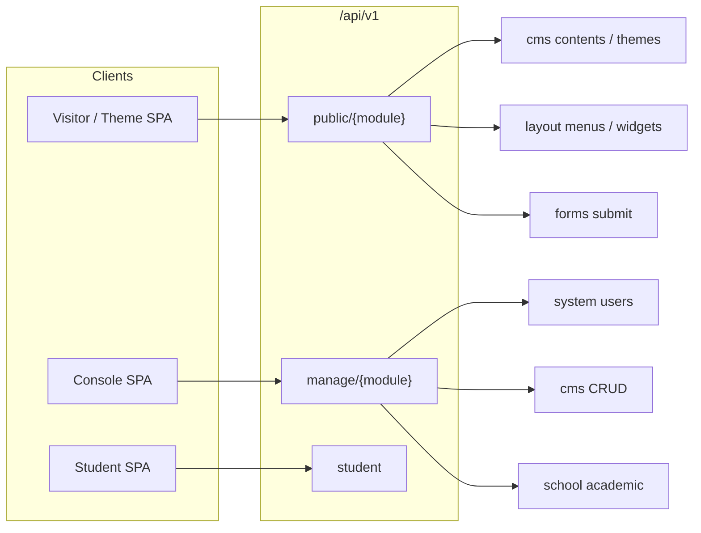

# JA-Platform: Platform Separation Master Plan

> **Status:** Draft — untuk diskusi & eksekusi bertahap (ACC per fase)  
> **Tanggal:** 2026-05-15  
> **Prinsip:** CMS adalah *satu aplikasi*, bukan fondasi platform. Service tier dipakai ulang oleh School, Toko, RS, dan modul masa depan.

Dokumen ini menggabungkan keputusan arsitektur, audit kode, pemetaan modul **Layout** vs **Theme**, strategi **redirect**, standar **API Surface** (`public` / `manage`, deprecate `ja`), **urutan prioritas** eksekusi, roadmap fase, dan appendix migrasi frontend.

**Dokumen terkait:**
- `JA-Platform_Modular_System_Blueprint.md`
- `module_refactoring_plan.md`
- `module_communication_standard.md`
- `cms-theming.md`
- `architectural_status.md` / `multi-unit-architecture.md`

---

## 1. Visi platform akhir

### 1.1 Yang kita bangun

**JA-Platform** = kernel + service engines + aplikasi domain (plug-in).

| Lapisan | Peran | Contoh |
|---------|--------|--------|
| **Kernel** | Boot, auth, workspace, registry, settings global | `System` |
| **Ops** | Keamanan, backup, cron, domain routing | `Security`, `Infra` |
| **Service** | Engine reusable tanpa domain bisnis | `Media`, `Library`, `Layout`, `Forms`, `Newsletter`, `Search` |
| **Application** | Produk bisnis | `Cms`, `School`, (future) `Shop`, `Hospital` |

**School** adalah contoh integrasi awal — bukan pusat desain. User bisa memasang hanya School + Layout + Media tanpa CMS.

### 1.2 Kriteria “selesai” (Definition of Done global)

Setiap fase dianggap selesai jika:

- [ ] `php artisan migrate:fresh --seed` sukses (SQLite/PgSQL target)
- [ ] `composer run quality` — PHPStan **level 9** tanpa internal error
- [ ] Tes modul terkait fase **lulus**; tidak ada referensi tabel `core_*` di path yang disentuh
- [ ] Tidak ada import `Modules\Cms\*` dari `System` / Service tier (kecuali bridge sementara terdokumentasi)
- [ ] Route baru mengikuti §4: `/api/v1/{surface}/{module}/...`; tidak menambah endpoint di prefix `ja` atau `admin/*`
- [ ] Bridge legacy (jika masih ada) memakai header `Deprecation` + dokumentasi successor
- [ ] Checklist file inventory fase ditandai ✅

### 1.3 Fokus waktu

- **Masa kini & masa depan:** schema `sys_`, `lib_`, `lay_`, `srv_media_`, `cms_`, `sch_`, dll.
- **Legacy `core_*`:** tidak menjadi fondasi; hanya catatan historis / skrip one-off (tidak masuk fase 1).

---

## 2. Keputusan arsitektur (disepakati)

| Topik | Keputusan |
|-------|-----------|
| Tag & custom fields | Modul **`Library`** (`lib_*`) — definisi metadata, pivot nilai per aplikasi |
| Forms / Newsletter / Search | **Tiga modul terpisah:** `Forms`, `Newsletter`, `Search` |
| Menu & widget | Modul **`Layout`** (`lay_*`) — lintas modul, registry location |
| Theme (Vue, manifest, Janari) | Pindah ke **`Layout`** — presentation pack aplikasi situs & integrasi visual |
| Redirect | **Dua lapisan** (lihat §5) — Infra (host/domain) + Layout (path/URL) |
| Production legacy | Tidak dual-support `core_*` jangka panjang |
| Frontend | Backend dulu; appendix §13 untuk rename `Core` → `System` |
| **API URL** | Standar `{surface}/{module}/{resource}` — **`ja` di-deprecate** (lihat §4) |

---

## 3. Peta modul & prefix tabel

```
backend/Modules/
├── System/          # Tier 1 — sys_, srv_auth_
├── Security/        # Tier 2 — sec_
├── Infra/           # Tier 2 — infra_
├── Media/           # Tier 3 — srv_media_
├── Library/         # Tier 3 — lib_*          [BARU]
├── Layout/          # Tier 3 — lay_*          [BARU]
├── Forms/           # Tier 3 — frm_*          [BARU]
├── Newsletter/      # Tier 3 — nwl_*          [BARU]
├── Search/          # Tier 3 — srch_*         [BARU]
├── Analytics/       # Tier 3 — analytics_*    [ADA]
├── Ai/              # Tier 3 — ai_*           [ADA]
├── Cms/             # Tier 4 — cms_*          [SLIM]
└── School/          # Tier 4 — sch_*          [ADA]
```

### 3.1 System (kernel) — tetap tipis

**Miliki:** User, Auth, RBAC, Setting, Plugin, ActivityLog, LoginHistory, Notification, ScheduledTask, 2FA, RedisSetting, Language, Translation, EmailTemplate (komunikasi platform), registries (`DashboardRegistry`, `HookRegistry`, `LayoutRegistry`*, `PermissionRegistry`*).

**Jangan miliki:** konten blog, theme Vue, form builder, tag konten, menu instance.

\*Registry interface di System; implementasi data di modul masing-masing.

**Utang saat ini:** 12 model tanpa migrasi; Jobs hilang; ~20 controller Console belum di-route `manage/system`; coupling `TagController` → `Cms\Models\Tag`.

### 3.2 Library — metadata bersama

| Tabel | Isi |
|-------|-----|
| `lib_tags` | Tag + `type` (content, media, student, product, …) |
| `lib_taggables` | Polymorphic pivot |
| `lib_custom_fields` | Definisi field (type, rules, options) |
| `lib_field_groups` | Grouping |
| `lib_field_group_assignments` | `assignable_type` + module scope |

**Nilai field:** `cms_*`, `sch_*`, dll. — bukan di Library.

**Migrasi dari:** `cms_tags`, `cms_content_custom_fields`, `System\Models\CustomField*`, controller delegasi di Cms.

### 3.3 Layout — struktur navigasi & surface UI

Lihat **§6** (cakupan lengkap).

### 3.4 Forms / Newsletter / Search

Masing-masing modul mandiri dengan contract + route `manage/forms`, `manage/newsletter`, `manage/search`.

**Migrasi dari:** `cms_forms*`, `cms_newsletter_subscribers`, `cms_search_*`.

### 3.5 Media — sudah ada, perlu disiplin

Engine file/folder/usage di `Modules/Media`. API seharusnya `manage/media/*`, bukan hanya `manage/cms/media`.

**Utang:** schema folder (`author_id`, `module`, `slug`), `MediaServiceInterface` vs UUID, controller masih di Cms.

### 3.6 Cms (slim) — hanya aplikasi editorial/situs

**Miliki:** Content, Category, ContentRevision, Comment-on-content, SeoService (konten), Sitemap XML (konten), pivot nilai custom field konten.

**Tidak miliki:** Menu, Widget, Theme, Form, Newsletter, Search index, Tag definition, path redirect, media engine.

### 3.7 School — aplikasi akademik

Konsumen Layout (portal), Library (metadata siswa nanti), Media, Forms (pendaftaran), Search (opsional).

---

## 4. API Surface & URL Map

### 4.1 Masalah prefix `ja` (kondisi sekarang)

Prefix `ja` dipakai **hanya** di `Modules/Cms/routes/api.php` sebagai grup route **publik situs** (tanpa Sanctum): konten, menu, widget, form, search, newsletter.

| Fakta | Dampak |
|-------|--------|
| `ja` ≈ singkatan brand (JA-Platform), **bukan** nama modul | Developer mengira ini “namespace CMS”, padahal isinya campuran service |
| Console memakai `manage/cms/*` | Dua pola penamaan: `ja` (publik) vs `manage/cms` (admin) — **inkonsisten** |
| Analytics pakai `/api/v1/analytics/*` langsung | Modul lain tidak mengikuti pola yang sama |
| System pakai `/manage/users` tanpa segment `system` | Segment modul hilang di kernel |

**Kesimpulan:** `ja` tidak “double path” dengan `manage/cms`, tetapi **double konsep** (surface publik disembunyikan di nama brand). Target: surface eksplisit + modul eksplisit.

### 4.2 Model tiga dimensi

Setiap endpoint = **`/api/v1` + `{surface}` + `{module}` + `{resource...}`**

```text
┌─────────────────────────────────────────────────────────────────┐
│  /api/v1                                                         │
│    ├── {surface}     ← SIAPA / AUTH (bukan nama produk)         │
│    │       ├── public      visitor, throttle, workspace scope    │
│    │       ├── manage      Console, Sanctum, permission          │
│    │       ├── student     portal siswa (role surface)           │
│    │       └── install     setup awal                          │
│    ├── {module}      ← PEMILIK DATA                             │
│    │       system | cms | school | layout | library | media |   │
│    │       forms | newsletter | search | security | infra | ai  │
│    └── {resource}    ← REST (/contents, /menus, …)              │
└─────────────────────────────────────────────────────────────────┘
```

**Tidak pernah:** `/api/v1/ja/manage/cms/...` atau `/public/cms/manage/...` — surface dan module masing-masing **sekali**.

### 4.3 Peta surface (target akhir)

#### A. `public` — akses pengunjung / SPA frontend

Tanpa login (kecuali rate limit + `IdentifyWorkspace` dari Host).

| Modul | Path dasar | Contoh resource |
|-------|------------|-----------------|
| `cms` | `/api/v1/public/cms/` | `contents`, `categories`, `themes/active`, `contents/{id}/comments` |
| `layout` | `/api/v1/public/layout/` | `menus?module=cms&location=header-main`, `widgets?module=school&location=portal-sidebar` |
| `forms` | `/api/v1/public/forms/` | `{slug}`, `{slug}/submit`, `{slug}/track` |
| `search` | `/api/v1/public/search/` | `?q=`, `suggestions` |
| `newsletter` | `/api/v1/public/newsletter/` | `subscribe`, `unsubscribe` |
| `analytics` | `/api/v1/public/analytics/` *atau* tetap `/api/v1/analytics/` | `track-visit`, `track` — **satu pola dipilih saat Fase 9** |

#### B. `manage` — Console (admin/staff)

`auth:sanctum` + Spatie permission + `bypass_unit_scope` bila perlu.

| Modul | Path dasar |
|-------|------------|
| `system` | `/api/v1/manage/system/` — users, settings, roles, 2fa, languages, plugins, notifications |
| `cms` | `/api/v1/manage/cms/` — contents, themes (admin), categories, SEO tools |
| `school` | `/api/v1/manage/school/` — institution, academic, lms, hr, … |
| `layout` | `/api/v1/manage/layout/` — menus, widgets, url-rewrites |
| `library` | `/api/v1/manage/library/` — tags, custom-fields, field-groups |
| `media` | `/api/v1/manage/media/` — files, folders, trash |
| `forms` | `/api/v1/manage/forms/` |
| `newsletter` | `/api/v1/manage/newsletter/` |
| `search` | `/api/v1/manage/search/` — admin stats, reindex |
| `security` | `/api/v1/manage/security/` |
| `infra` | `/api/v1/manage/infra/` — backups, webhooks, **domain-redirects** |
| `analytics` | `/api/v1/manage/analytics/` |
| `ai` | `/api/v1/manage/ai/` |

**Auth entry (khusus):** tetap bisa di root v1 untuk kompatibilitas singkat:

- `POST /api/v1/login`, `POST /api/v1/logout`, `GET /api/v1/user`  
- Target jangka panjang: `/api/v1/manage/system/auth/*` + bridge ke path lama.

#### C. `student` — portal siswa

Tetap surface terpisah (bukan `manage`) karena policy berbeda:

- `/api/v1/student/dashboard`, `/api/v1/student/lms/...`

#### D. Legacy — deprecated (hapus bertahap)

| Prefix lama | Pengganti | Status |
|-------------|-----------|--------|
| `/api/v1/ja/*` | `/api/v1/public/{module}/*` | Deprecate → hapus |
| `/api/v1/admin/core/*` | `/api/v1/manage/system/*` | Bridge only |
| `/api/v1/admin/cms/*` | `/api/v1/manage/cms/*` | Bridge only |
| `/api/v1/admin/school/*` | `/api/v1/manage/school/*` | Bridge only |
| `/manage/users` (tanpa system) | `/manage/system/users` | Migrasi Fase 7–9 |

### 4.4 Diagram alur request



**Contoh alur visitor (blog):**

1. `GET /api/v1/public/cms/themes/active`
2. `GET /api/v1/public/layout/menus?module=cms&location=header-main`
3. `GET /api/v1/public/cms/contents?type=post`
4. `GET /api/v1/public/layout/widgets?module=cms&location=sidebar`

**Contoh alur admin:**

1. `POST /api/v1/login` → token
2. `GET /api/v1/manage/cms/contents`
3. `PUT /api/v1/manage/cms/contents/{id}`

### 4.5 Tabel migrasi `ja` → `public/{module}`

| Sekarang (`/api/v1/ja/...`) | Target | Fase route aktif |
|-----------------------------|--------|------------------|
| `GET /ja/contents` | `GET /public/cms/contents` | 9 (bridge `ja` sampai frontend migrasi) |
| `GET /ja/contents/{slug}` | `GET /public/cms/contents/{slug}` | 9 |
| `GET /ja/categories` | `GET /public/cms/categories` | 9 |
| `GET /ja/tags` | `GET /public/library/tags` | 1 + 9 |
| `GET /ja/themes/active` | `GET /public/cms/themes/active` | 9 |
| `GET /ja/menus/location/{loc}` | `GET /public/layout/menus?module=cms&location={loc}` | 2 + 9 |
| `GET /ja/widgets/location/{loc}` | `GET /public/layout/widgets?module=cms&location={loc}` | 2 + 9 |
| `GET /ja/forms/{slug}` | `GET /public/forms/{slug}` | 4 + 9 |
| `POST /ja/forms/{slug}/submit` | `POST /public/forms/{slug}/submit` | 4 + 9 |
| `GET /ja/search` | `GET /public/search` | 5 + 9 |
| `POST /ja/newsletter/subscribe` | `POST /public/newsletter/subscribe` | 5 + 9 |

**Aturan bridge (Fase 9):** route lama tetap mendaftar, mem-forward ke controller yang sama, response header:

```http
Deprecation: true
Link: </api/v1/public/cms/contents>; rel="successor-version"
```

Tidak menambah fitur baru di bawah `ja` setelah Fase 0.

### 4.6 File backend terkait (route & middleware)

| File | Peran migrasi API |
|------|-------------------|
| `Modules/Cms/routes/api.php` | Pisah grup `ja` → `public/cms`; hapus menu/widget/form/search dari grup lama saat modul pindah |
| `Modules/System/routes/api.php` | Tambah prefix `manage/system`; bridge `admin/core` |
| `Modules/School/routes/api.php` | Sudah `manage/school` — bersihkan `admin` bridge |
| `Modules/Media/routes/api.php` | Sudah `manage/media` — referensi standar |
| `Modules/Layout/routes/api.php` | **[BARU]** `public/layout`, `manage/layout` |
| `Modules/Library/routes/api.php` | **[BARU]** `public/library` (tags read), `manage/library` |
| `Modules/Forms/Newsletter/Search/routes/api.php` | **[BARU]** masing-masing public + manage |
| `bootstrap/app.php` | `MaintenanceBypass`: ganti pola `api/v1/ja*` → `api/v1/public/*` |
| `Modules/System/app/Traits/MaintenanceBypass.php` | Idem |

### 4.7 File frontend terkait (appendix detail §13)

| Area | File contoh | Dari | Ke |
|------|-------------|------|-----|
| Theme | `shared/composables/useTheme.ts` | `/ja/themes/active` | `/public/cms/themes/active` |
| Menu | `shared/composables/useMenu.ts` | `/ja/menus/location/...` | `/public/layout/menus?...` |
| CMS store | `modules/Cms/stores/cms.ts` | `/ja/contents` | `/public/cms/contents` |
| Comments | `modules/Cms/components/comments/*` | `/ja/contents/.../comments` | `/public/cms/contents/.../comments` |
| Newsletter widget | `NewsletterWidget.vue` | `/ja/newsletter/subscribe` | `/public/newsletter/subscribe` |
| API client base | `shared/services/api` atau axios config | pastikan prefix `/api/v1` + surface | dokumentasi env |

Eksekusi frontend: **setelah Fase 9 backend** (bridge `ja` masih hidup).

---

## 5. Strategi redirect (dua lapisan)

Redirect **bukan satu kotak**. Ini mempersiapkan multi-workspace & multi-domain.

### 5.1 Infra — redirect operasional (host / domain)

| Aspek | Nilai |
|-------|--------|
| **Tabel** | `infra_redirects` |
| **Scope** | `workspace_id`, optional `host` / `domain_pattern` |
| **Use case** | `old-sekolah.id` → `smk.example.com`; HTTP→HTTPS; maintenance landing; wildcard subdomain → workspace |
| **Middleware** | `IdentifyWorkspace` **sebelum** atau terintegrasi — resolve tenant dari Host |
| **Modul** | `Infra` |
| **Route admin** | `manage/infra/redirects` |

**Tidak** menangani `/blog/post-lama` → `/berita/post-baru` (itu path level).

### 5.2 Layout — rewrite path (URL aplikasi)

| Aspek | Nilai |
|-------|--------|
| **Tabel** | `lay_url_rewrites` (rename dari konsep `cms_redirects`) |
| **Kolom kunci** | `module` (cms, school, shop), `from_path`, `to_path`, `status_code`, `workspace_id`, `is_active`, `hits` |
| **Use case** | SEO 301, rename halaman portal sekolah, pindah slug tanpa ubah domain |
| **Middleware** | `Layout\Http\Middleware\ApplyUrlRewrites` — replace `Cms\Http\Middleware\HandleRedirects` |
| **Route admin** | `manage/layout/url-rewrites` |

**Migrasi dari:** `cms_redirects`, `HandleRedirects.php`, `RedirectController.php`.

### 5.3 Form redirect vs platform redirect

| Jenis | Lokasi | Catatan |
|-------|--------|---------|
| `forms.redirect_url` setelah submit | **Forms** | Bukan infra/layout |
| Auth / Security challenge redirect | **Security** / **System** | Tetap di modul masing-masing |

---

## 6. Modul Layout — cakupan lengkap

### 6.1 Prinsip pemisahan Layout vs Theme (CMS)

| Konsep | Modul | Penjelasan |
|--------|--------|------------|
| **Theme** | **Cms** | Paket presentasi: file Vue (`frontend/.../themes/{slug}`), `theme.json`, manifest, assets, custom CSS, hooks, shortcodes, **definisi widget area & menu location slot** |
| **Menu & item (data)** | **Layout** | Instance navigasi: tree, polymorphic target, per `module` + `location` |
| **Widget instance (data)** | **Layout** | Instance widget di location: `type`, `settings` JSON, sort order |
| **URL rewrite (path)** | **Layout** | §5.2 |
| **Console sidebar** | **System** registry | Bukan menu publik — tetap `MenuRegistry` di System |

**Analogi:** Theme = **cetakan/layout cetak**; Layout module = **isi** yang mengisi slot (menu, widget, rewrite).

### 6.2 Yang masuk modul Layout

| Domain | Model / tabel | Sumber saat ini |
|--------|---------------|-----------------|
| Menu | `lay_menus` | `cms_menus` |
| Menu item | `lay_menu_items` | `cms_menu_items` |
| Widget instance | `lay_widgets` | `cms_widgets` |
| URL rewrite | `lay_url_rewrites` | `cms_redirects` |
| (opsional fase 2) Block zones | `lay_zones` | — |

**Kolom tambahan (standar):**

- `module` — string: `cms`, `school`, `shop`, …
- `location` — string: `header-main`, `portal-sidebar`, …
- `workspace_id` — multi-tenant (sudah ada pola `ScopedByWorkspace`)
- MenuItem: `target_type`, `target_id`, `url`, `route_name`, `open_in_new_tab`, mega-menu meta

### 6.3 Yang tetap di CMS (Theme & editorial chrome)

| Domain | Path / tabel | Alasan |
|--------|--------------|--------|
| Theme registry | `cms_themes` | Terikat Vue theme pack & `ThemeService` |
| ThemeService, ThemeCacheService, ThemeHooksService | `Modules/Cms/app/Services/` | Cache manifest, hooks, aktivasi |
| ThemeController, `theme:make`, backfill Janari | `Modules/Cms/` | Dev tooling CMS |
| ThemeManifest, ThemeViews, helpers | `Modules/Cms/app/Helpers/` | Resolusi path frontend |
| Menu **locations** (schema manifest) | `theme.json` → `ThemeService::getMenuLocations()` | **Definisi slot**, bukan data menu |
| Widget **areas** (schema manifest) | manifest + `ThemeCacheService::rememberWidgetArea` | **Definisi area**, bukan instance |
| Public active theme API | `GET /api/v1/ja/themes/active` | Konsumen SPA CMS |

**Integrasi Layout ↔ Theme:**

1. Theme manifest mendeklarasikan `locations: [{ key: "header-main", label: "..." }]`.
2. `LayoutRegistry::registerLocations('cms', [...])` bisa di-sync dari manifest saat theme aktif (event `ThemeActivated`).
3. `MenuController` validasi `location.in` mengambil dari **LayoutRegistry** + manifest theme aktif untuk modul `cms`.
4. School mendaftar `portal-header` tanpa theme CMS — cukup `LayoutRegistry` di `SchoolServiceProvider`.

### 6.4 Yang tidak masuk Layout

| Domain | Modul benar |
|--------|-------------|
| Konten / halaman / blog | Cms |
| File upload | Media |
| Dashboard console widgets | System `DashboardRegistry` |
| Theme Vue components | Frontend `Cms/views/themes` |
| Email template | System |
| Custom field definition | Library |

### 6.5 LayoutRegistry (di System, implementasi Layout)

```php
// System — contract only
interface LayoutRegistryInterface {
    public function registerLocations(string $module, array $locations): void;
    public function getLocations(string $module): array;
    public function registerWidgetTypes(string $module, array $types): void;
}
```

Modul aplikasi memanggil di `boot()`:

```php
// SchoolServiceProvider
$registry->registerLocations('school', [
    ['key' => 'portal-header', 'label' => 'Portal Header'],
    ['key' => 'portal-footer', 'label' => 'Portal Footer'],
]);
```

### 6.6 API surface Layout

| Method | Path | Keterangan |
|--------|------|------------|
| GET | `/api/v1/public/layout/menus` | Query: `module`, `location` — publik |
| GET | `/api/v1/public/layout/widgets` | Query: `module`, `location` — publik |
| CRUD | `/api/v1/manage/layout/menus` | Console |
| CRUD | `/api/v1/manage/layout/widgets` | Console |
| CRUD | `/api/v1/manage/layout/url-rewrites` | Console |

---

## 7. Inventori ekstraksi dari CMS (file acuan)

Sebelum mengubah kode, gunakan checklist ini. **Jangan hapus** sampai migrasi + tes hijau.

### 7.1 → Library

| File saat ini | Aksi |
|---------------|------|
| `Cms/app/Models/Tag.php` | Pindah → `Library/Models/Tag.php` |
| `Cms/database/.../cms_tags`, `cms_media_tags` | Migrasi → `lib_*` |
| `Cms/app/Http/Controllers/Api/CustomFieldController.php` | Pindah atau delegasi ke Library |
| `Cms/app/Http/Controllers/Api/FieldGroupController.php` | Pindah |
| `System/app/Http/Controllers/Console/TagController.php` | Pindah ke Library; hapus dependency Cms |
| `System/app/Models/CustomField.php`, `FieldGroup.php`, `ContentCustomField.php` | Pindah definisi ke Library; pivot nilai tetap per app |
| `Cms/app/Models/ContentCustomField.php` | Tetap Cms (nilai) |
| `Media/app/Services/MediaService.php` (import Cms Tag) | Ganti ke Library contract / event |

### 7.2 → Layout

| File saat ini | Aksi |
|---------------|------|
| `Cms/app/Models/Menu.php`, `MenuItem.php` | Pindah |
| `Cms/app/Models/Widget.php` | Pindah |
| `Cms/app/Models/Redirect.php` | Pindah → `UrlRewrite` |
| `Cms/app/Http/Controllers/Api/MenuController.php` | Pindah |
| `Cms/app/Http/Controllers/Api/WidgetController.php` | Pindah |
| `Cms/app/Http/Controllers/Api/RedirectController.php` | Pindah |
| `Cms/app/Http/Middleware/HandleRedirects.php` | Pindah → `ApplyUrlRewrites` |
| `Cms/database/factories/Menu*.php`, `Widget*.php`, `Redirect*.php` | Pindah |
| `Cms/database/seeders/MenuLocationStandardizationSeeder.php` | Adaptasi ke LayoutRegistry |
| `bootstrap/app.php` (middleware redirect) | Update namespace |

### 7.3 → Forms / Newsletter / Search

| Modul | File sumber (Cms) |
|-------|-------------------|
| Forms | `Form.php`, `FormField.php`, `FormSubmission.php`, `FormAnalytics.php`, `FormController.php`, `FormSubmissionController.php`, `Exports/FormSubmissionsExport.php`, `Rules/FormRedirectUrl.php` |
| Newsletter | `NewsletterSubscriber.php`, `NewsletterController.php`, `Mail/NewsletterWelcome.php` |
| Search | `SearchIndex.php`, `SearchQuery.php`, `SearchController.php`, `SearchService.php` |

### 7.4 → Media (rapikan, bukan pindah dari Cms)

| File | Aksi |
|------|------|
| `Cms/.../MediaController.php` | Thin wrapper atau pindah route ke `Media\Http\Controllers` |
| `Cms/.../MediaFolderController.php` | Fix `FileFolder` → `Folder`; route `manage/media` |
| `Media/app/Services/MediaService.php` | Selaraskan interface UUID |
| `Media/database/migrations/...` | Lengkapi kolom folder |

### 7.5 Tetap di Cms

`Content*`, `Category`, `Theme*`, `Comment`, `SeoController`, `SitemapController`, `Theme*Service`, seeders tema/konten.

### 7.6 Utang lintas modul (bersihkan di Fase 0)

| Issue | Lokasi |
|-------|--------|
| `MediaService::restore` signature | Media |
| Jobs hilang | `System/Jobs/QueueHeartbeatJob`, `SendBroadcastNotification` |
| `core_*` di validasi/test | Lihat §12 |
| `admin/core` bridge | System, Infra, Security, Ai routes |
| PHPStan internal error | Jobs di atas |

---

## 8. Roadmap eksekusi (bertahap, ACC per fase)

### 8.0 Urutan prioritas global

Eksekusi **wajib berurutan** kecuali sub-task dalam Fase 5 (Newsletter ‖ Search) dan item bertanda *(paralel)*.

| Prioritas | Fase | Fokus | Alasan urutan |
|:---------:|:----:|-------|----------------|
| **P0** | 0 | Stabilisasi (Media UUID, Jobs, schema, `core_*` tes) | Blocker PHPStan & PHPUnit — tanpa ini fase lain tidak terukur |
| **P1** | 1 | Library (`lib_*`) | Tag & custom field dipakai Media, Cms, School — fondasi metadata |
| **P2** | 2 | Layout (menu, widget, path rewrite) | Portal School + situs CMS; persiapan multi-modul |
| **P3** | 3 | Infra domain redirects | Multi-host/workspace; tidak bentrok `lay_url_rewrites` |
| **P4** | 4 | Forms | Modul service pertama yang terpisah; pola untuk P5 |
| **P5** | 5 | Newsletter + Search *(bisa paralel)* | Dua modul kecil independen |
| **P6** | 6 | Media API `manage/media` | Rapikan sebelum CMS slim |
| **P7** | 7 | CMS slim + `manage/system/*` | Hapus kode pindah; System routes lengkap |
| **P8** | 9 | **API Surface** (`ja` → `public/{module}`) | Setelah modul & route manage stabil; bridge lama |
| **P9** | 8 | School integration pass | RBAC & Layout locations; tes `/manage/school` |
| **P10** | — | Frontend (§13) | Setelah P8 bridge backend siap |

**Route `public/*` per modul:** daftarkan **bersamaan** saat modul itu selesai (Fase 1–5), bukan menunggu Fase 9. **Fase 9** = konsolidasi, bridge `ja`, MaintenanceBypass, hapus duplikasi.

```text
P0 ──► P1 ──► P2 ──► P3 ──► P4 ──► P5 ──► P6 ──► P7 ──► P8 ──► P9 ──► P10
                              ╲      ╱
                               Newsletter ‖ Search
```

---

### Fase 0 — Stabilisasi kernel & debt blocker

**Tujuan:** `migrate:fresh`, PHPStan 9, PHPUnit bisa jalan.

| # | Task | File utama |
|---|------|------------|
| 0.1 | Selaraskan `MediaServiceInterface` + implementasi (UUID) | ✅ Done |
| 0.2 | Perbaiki schema `srv_media_folders` | ✅ Done |
| 0.3 | Fix `MediaFolderController` (`Folder`, import) | ✅ Done |
| 0.4 | Tambah/stub Jobs System | ✅ Done |
| 0.5 | Ganti assert/validasi `core_*` → nama tabel baru | ✅ Done |
| 0.6 | Lengkapi migrasi System untuk model yang dipakai production | ✅ Done |

**Gate:** `composer run quality` + `php artisan test` (minimal smoke) hijau.


### Fase 1 — Modul Library

| # | Task | Status |
|---|------|--------|
| 1.1 | Scaffold `Modules/Library` (module.json, provider, routes) | ✅ Done |
| 1.2 | Migration `lib_tags`, `lib_taggables`, `lib_custom_fields`, `lib_field_groups` | ✅ Done |
| 1.3 | Pindah model + controller + policies + permissions | ✅ Done |
| 1.4 | Route `manage/library/*` + `public/library/tags` (read) | ✅ Done |
| 1.5 | Bridge: `manage/cms/tags` → forward Library + `Deprecation` | ✅ Done |
| 1.6 | Update `ContentService` / Media untuk Library tag pivot | ✅ Done |
| 1.7 | Hapus `System\TagController` dependency ke Cms | ✅ Done |

**Gate:** Tes tag + custom field; Cms boot tanpa definisi tag di folder Cms; public tags via `/public/library/tags`.

---

### Fase 2 — Modul Layout
| # | Task | |
|---|------|---|
| 2.1 | Scaffold `Modules/Layout` | ✅ Done |
| 2.2 | Migrasi `lay_menus`, `lay_menu_items`, `lay_widgets`, `lay_url_rewrites` | ✅ Done |
| 2.3 | `LayoutRegistry` di System + binding | ✅ Done |
| 2.4 | Pindah controller, middleware `ApplyUrlRewrites` | ✅ Done |
| 2.5 | Tambah kolom `module`; seeder location School + CMS | ✅ Done |
| 2.6 | Integrasi validasi location dengan Theme manifest (modul cms) | ✅ Done |
| 2.7 | Route `public/layout/menus`, `public/layout/widgets` (query `module`, `location`) | ✅ Done |
| 2.8 | Bridge sementara: `ja/menus/*`, `ja/widgets/*` → Layout | ✅ Done |

**Gate:** Menu portal School + menu CMS dari Layout; middleware rewrite jalan; public API sesuai §4.3.

---

### Fase 3 — Infra domain redirects
| # | Task | |
|---|------|---|
| 3.1 | Tabel `infra_redirects` + model | ✅ Done |
| 3.2 | Integrasi dengan `IdentifyWorkspace` (host → workspace) | ✅ Done |
| 3.3 | Controller `manage/infra/redirects` | ✅ Done |
| 3.4 | Dokumentasi multi-domain | ✅ Done |

**Gate:** Tes resolve workspace by Host; tidak bentrok dengan `lay_url_rewrites`.

---

### Fase 4 — Forms (modul pertama service split)
| # | Task | |
|---|------|---|
| 4.1 | Scaffold `Modules/Forms` | ✅ Done |
| 4.2 | Migrasi `frm_*` | ✅ Done |
| 4.3 | Pindah controller, export, rules | ✅ Done |
| 4.4 | Route `manage/forms` + `public/forms/{slug}` (+ submit/track) | ✅ Done |
| 4.5 | Cms hapus model form; daftar form di dashboard via registry | ✅ Done |

**Gate:** Tes form submission; StudioSeeder disesuaikan.

---

### Fase 5 — Newsletter & Search
| # | Task | |
|---|------|---|
| 5a | Modul Newsletter: `manage/newsletter`, `public/newsletter/subscribe` | ✅ Done |
| 5b | Modul Search: `manage/search`, `public/search` + listener reindex dari Cms | ✅ Done |

*(Paralel)* — struktur sama Fase 4.

**Gate:** Subscribe + reindex content via event dari Cms listener; public search/newsletter sesuai §4.3.

---

### Fase 6 — Media API consolidation
| # | Task | |
|---|------|---|
| 6.1 | Route `manage/media/*` | ✅ Done |
| 6.2 | Cms controller → delegasi tipis atau hapus | ✅ Done |
| 6.3 | Permission `media.*` tetap; dokumentasi | ✅ Done |

---

### Fase 7 — CMS slim & System routes
| # | Task | |
|---|------|---|
| 7.1 | Hapus kode mati di Cms (form, menu, widget, redirect, search) | ✅ Done |
| 7.2 | Route `manage/system/*` untuk controller Console yang ada | ✅ Done |
| 7.3 | Update `system_refactoring_progress.md` — status realistis | ✅ Done |
| 7.4 | Deprecation timeline `admin/core` | ✅ Done |

---

### Fase 9 — API Surface standardization (`ja` deprecation)
| # | Task | |
|---|------|---|
| 9.1 | Registrasi route canonical `public/{module}/*` untuk semua modul | ✅ Done |
| 9.2 | Bridge grup `Route::prefix('ja')` → forward ke `public/*` | ✅ Done |
| 9.3 | Migrasi `manage/users` → `manage/system/users` (+ bridge) | ✅ Done |
| 9.4 | Update `MaintenanceBypass`, WAF allowlist path ke `public/*` | ✅ Done |
| 9.5 | Putuskan satu pola analytics publik: `/public/analytics` | ✅ Done |
| 9.6 | PHPUnit & feature tests: assert path baru | ✅ Done |
| 9.7 | Timeline hapus bridge `ja` | ✅ Done |

**Gate:** Tidak ada endpoint baru di `ja`; dokumentasi OpenAPI/Scramble memakai path `public/*` dan `manage/*`; checklist §4.5 ✅.

**Catatan:** Fitur modul baru setelah fase ini **dilarang** memakai prefix `ja`.

---

### Fase 8 — School integration pass
| # | Task | |
|---|------|---|
| 8.1 | School daftar Layout locations (portal) via `LayoutRegistry` | ✅ Done |
| 8.2 | Tes RBAC ke `/manage/school` (bukan `/admin/`) | ✅ Done |
| 8.3 | `SchoolDatabaseSeeder` di `DatabaseSeeder` (opsional flag) | ✅ Done |
| 8.4 | Contoh konsumen `public/layout/menus?module=school&location=portal-header` | ✅ Done |

**Urutan vs Fase 9:** Fase 8 bisa mulai setelah Fase 2 (Layout); **selesai penuh** setelah P8 (route manage/system konsisten). Ideal: Fase 8 **setelah** Fase 7, **sebelum atau paralel** dengan Fase 9.

---

## 9. Pola kode: bersih, aman, performa

### 9.1 Anti-boilerplate

- **Satu alur hapus:** soft delete → trash → force delete — via service, bukan duplikasi di 3 controller.
- **Satu registry:** jangan duplikasi `HookService` vs `HookRegistry` — deprecate salah satu (Fase 7).
- **Satu dashboard registry:** merge `Registries\DashboardRegistry` vs `Services\DashboardRegistry`.

### 9.2 Keamanan

- Permission per modul: `layout.menus.view`, `library.tags.manage`, dll.
- URL rewrite: validasi tidak open redirect (`to_path` internal atau allowlist).
- Form redirect rule tetap di Forms (`FormRedirectUrl`).

### 9.3 Performa

- Cache key: `layout:menu:{module}:{location}:{workspaceId}` — ganti `menu_location_*` yang ada.
- Theme cache tetap di Cms (`ThemeCacheService`) — jangan campur dengan Layout cache.
- Search reindex: queue job per modul (listener).

### 9.4 Komunikasi antar modul

Ikuti `module_communication_standard.md`:

- Cms mem-fire `ContentPublished` → Search listener mengindeks.
- User deleted → Media listener hapus avatar.
- **Tanpa** `use Modules\Cms\Models\Tag` di Media/System.

---

## 10. Matriks: “fitur dulu di CMS” → tier akhir

| Fitur | Tier akhir | Modul |
|-------|------------|-------|
| User, auth, RBAC | 1 | System |
| Settings, plugins, i18n | 1 | System |
| Backup, webhooks, cron | 2 | Infra |
| WAF, security log | 2 | Security |
| Files, thumbnails | 3 | Media |
| Tags, custom fields (definisi) | 3 | Library |
| Menu, widget, path rewrite | 3 | Layout |
| Domain redirect | 2 | Infra |
| Forms | 3 | Forms |
| Newsletter | 3 | Newsletter |
| Search | 3 | Search |
| Analytics | 3 | Analytics |
| AI | 3 | Ai |
| Content, theme, comment, SEO konten | 4 | Cms |
| Academic, HR, LMS | 4 | School |

---

## 11. Skenario pemasangan modul (masa depan)

| Kebutuhan user | Modul wajib | Opsional |
|----------------|-------------|----------|
| Hanya website yayasan | System, Layout, Media, Library, Cms, Forms | Newsletter, Search |
| Hanya sekolah (portal internal) | System, Layout, School, Media | Forms, Library |
| Sekolah + website | Semua di atas | Analytics, Ai |
| Toko online | System, Layout, Media, Library, **Shop** (baru), Search, Forms | Cms (landing) |
| Rumah sakit | System, Layout, **Hospital** (baru), Forms, Media | Cms (marketing) |

**Cms tidak wajib** untuk School-only.

---

## 12. Referensi utang `core_*` (bersihkan per fase)

| File | Referensi lama |
|------|----------------|
| `Cms/tests/Unit/Services/MediaServiceTest.php` | ✅ Cleaned |
| `Cms/tests/Unit/Services/SearchServiceTest.php` | ✅ Cleaned |
| `Cms/tests/Unit/Services/ContentServiceTest.php` | ✅ Cleaned |
| `Cms/.../CustomFieldController.php` | ✅ Cleaned |
| `Cms/.../FieldGroupController.php` | ✅ Cleaned |
| `Cms/.../ContentTemplateController.php` | ✅ Cleaned |
| `System/.../FileIntegrityService.php` | ✅ Cleaned |
| `System/.../CacheWarmingService.php` | ✅ Cleaned |
| `System/.../FoundationSeeder.php` | ✅ Cleaned |
| `app/Providers/RedisConfigServiceProvider.php` | ✅ Cleaned |
| `Media/.../MigrateLegacyMedia.php` | arsip — tidak fase 1 |

---

## 13. Appendix — migrasi frontend (catatan, eksekusi belakangan)

> Jalankan setelah **Fase 9** backend (bridge `ja` masih aktif selama migrasi).

### 13.1 Rename modul

| Saat ini | Target |
|----------|--------|
| `frontend/src/modules/Core/` | `frontend/src/modules/System/` |
| `useCoreStore`, `admin.html` | `useSystemStore`, `console.html` (sesuai rebrand) |

### 13.2 Pemetaan API (backend target)

Lihat tabel lengkap §4.5. Ringkasan:

| Area | Publik lama (`ja`) | Publik baru | Console |
|------|-------------------|-------------|---------|
| Contents | `/ja/contents` | `/public/cms/contents` | `/manage/cms/contents` |
| Theme aktif | `/ja/themes/active` | `/public/cms/themes/active` | `/manage/cms/themes` |
| Menu | `/ja/menus/location/{loc}` | `/public/layout/menus?module=cms&location={loc}` | `/manage/layout/menus` |
| Widget | `/ja/widgets/location/{loc}` | `/public/layout/widgets?module=...` | `/manage/layout/widgets` |
| Tags | `/ja/tags` | `/public/library/tags` | `/manage/library/tags` |
| Forms | `/ja/forms/{slug}` | `/public/forms/{slug}` | `/manage/forms` |
| Search | `/ja/search` | `/public/search` | `/manage/search` |
| Newsletter | `/ja/newsletter/subscribe` | `/public/newsletter/subscribe` | `/manage/newsletter` |
| Auth / users | `/admin/core/*` | — | `/manage/system/users` |
| Media | `/admin/cms/media` | — | `/manage/media` |
| School | `/admin/school/*` | `/public/...` (verification) | `/manage/school/*` |

### 13.3 File frontend prioritas sentuh

- `frontend/src/modules/Core/stores/*`
- `frontend/src/modules/Core/views/admin/settings/**`
- `frontend/src/modules/Cms/**` (media picker, menu editor)
- `frontend/src/shared/composables/useTheme.ts` — tetap Cms/public theme
- `frontend/tests/**` — update URL assertions

### 13.4 Urutan frontend (prioritas P10 — setelah Fase 9 backend)

| Step | Target | Status |
|------|--------|--------|
| 1 | API client: dukung `public/*` + `manage/system/*` | ✅ Selesai |
| 2 | `useTheme`, `cms` stores → `public/cms/*` | ✅ Selesai |
| 3 | `useMenu` → `public/layout/menus` | ✅ Selesai |
| 4 | Console: System module rename `Core` → `System` | ✅ Selesai |
| 5 | Console: Library, Layout, Media paths | ✅ Selesai |
| 6 | Forms / Newsletter / Search admin + public | ✅ Selesai |
| 7 | Hapus pemanggilan `/ja/*` dan `/admin/core/*` | ✅ Selesai |
| 8 | Hapus bridge consumption (koordinasi tim) | ✅ Selesai |

---

## 14. Status dokumen & langkah berikutnya

| Item | Status |
|------|--------|
| Keputusan arsitektur tier | ✅ Disepakati |
| Redirect Infra vs Layout path | ✅ Dua lapisan (§5) |
| Layout vs Theme | ✅ Dipisah (§6) |
| API Surface (`public` / `manage` / deprecate `ja`) | ✅ Disepakati (§4) |
| Urutan prioritas global | ✅ §8.0 |
| Fase 0 stabilisasi | ✅ Selesai (Stabil) |
| Eksekusi kode Fase 1 - 10 | ✅ Selesai (Full Modularization) |
| Update `system_refactoring_progress.md` | ✅ Selesai (All phases completed) |

**Status Akhir Proyek:** Platform telah sepenuhnya bermigrasi ke arsitektur modular. Ketergantungan legacy telah dihapus dan API Surface telah distandarisasi.

---

*Dokumen ini akan diperbarui setiap fase selesai dengan tanggal, PR reference, dan checklist inventory §7.*
