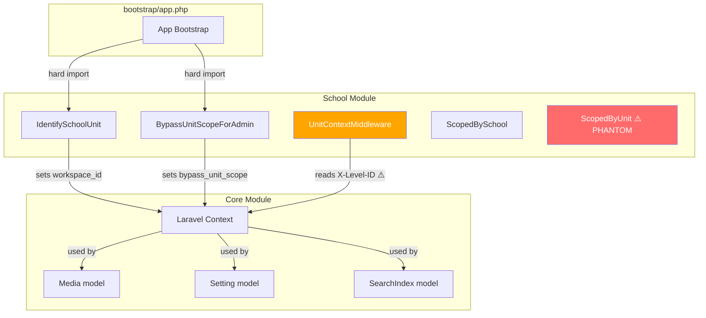
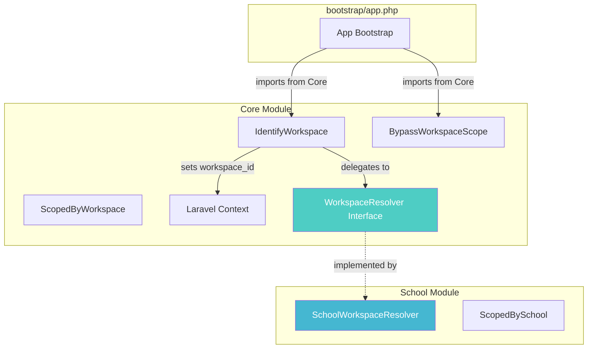

# 🔬 Workspace / Unit / Scope — Full Architecture Audit & Refactor Plan

> **Date:** 2026-05-13  
> **Scope:** Backend (Laravel), Database (Migrations/Models), Frontend (Vue/Pinia)  
> **Goal:** Establish `workspace_id` as the universal, module-agnostic scoping mechanism owned by **Core**

---

## 📊 Executive Summary

The platform's multi-tenancy system currently works but is architecturally inverted. The **School module** owns infrastructure that should belong to **Core**:
- Middleware that identifies the active workspace context
- Traits that scope database queries
- The bootstrap registration of these middleware

This means **Core cannot function without School**, which violates the foundational principle that Core must be self-sufficient.

### Current State Diagram



### Target State Diagram



---

## 🚨 Critical Issues Found

### Issue #1: Global Bootstrap Hard-Depends on School Module
**File:** [bootstrap/app.php](file:///opt/ja-platform/backend/bootstrap/app.php)  
**Severity:** 🔴 Critical  

```php
// Lines 33, 47, 63
\Modules\School\app\Http\Middleware\IdentifySchoolUnit::class,  // GLOBAL middleware
\Modules\School\app\Http\Middleware\BypassUnitScopeForAdmin::class, // Aliased as 'bypass_unit_scope'
```

If the School module is removed or disabled, **the entire application crashes at boot**.

---

### Issue #2: No `ScopedByWorkspace` Trait in Core
**Severity:** 🔴 Critical  

Core models (`Media`, `Setting`, `SearchIndex`) have `workspace_id` columns but **no automatic Global Scope** to filter queries. The scoping only works because `IdentifySchoolUnit` middleware sets `Context::add('workspace_id', ...)`, and individual controllers manually filter. There is no standardized, reusable trait.

---

### Issue #3: Phantom `ScopedByUnit` Trait
**File:** Referenced in [Student.php](file:///opt/ja-platform/backend/Modules/School/app/Models/Student/Student.php) and [Staff.php](file:///opt/ja-platform/backend/Modules/School/app/Models/HR/Staff.php)  
**Severity:** 🟡 High  

```php
use HasFactory, SoftDeletes, ScopedBySchool, ScopedByUnit, HasVerificationHash;
```

`ScopedByUnit` is referenced but **the file does not exist** anywhere in the project. This is either:
- A phantom reference that PHP silently ignores (unlikely — would cause fatal error)
- Defined somewhere we haven't found
- Was deleted but references weren't cleaned up

> [!WARNING]
> If `ScopedByUnit` doesn't exist, these models will throw `Trait not found` errors. This needs immediate investigation.

---

### Issue #4: HTTP Header Mismatch
**Severity:** 🟡 High  

| Component | Header Used |
|---|---|
| **Frontend** (`engine/api/client.ts` line 129) | `X-Workspace-ID` ✅ |
| **Backend** `UnitContextMiddleware` (line 22) | `X-Level-ID` ❌ |
| **Backend** `IdentifySchoolUnit` (line 27) | Reads from session `active_workspace_id` ✅ |

The frontend sends `X-Workspace-ID` but `UnitContextMiddleware` reads `X-Level-ID`. These are **out of sync**.

---

### Issue #5: Dual Context Keys in Laravel Context
**Severity:** 🟡 High  

The system uses TWO different context keys for scoping:

| Key | Set By | Used By |
|---|---|---|
| `workspace_id` | `IdentifySchoolUnit`, `UnitContextMiddleware` | Core models (Media, Settings, Search) |
| `school_id` | `IdentifySchoolUnit` | `ScopedBySchool` trait (Student, Staff) |
| `bypass_unit_scope` | `BypassUnitScopeForAdmin`, `IdentifySchoolUnit` | Manual checks in controllers |

`school_id` is a **School-domain concept** and should remain in School. But `workspace_id` and `bypass_unit_scope` are **infrastructure concepts** and must be owned by Core.

---

### Issue #6: Frontend Dual State Management
**Severity:** 🟡 High  

| Store | Module | Session Keys Used | Manages |
|---|---|---|---|
| `useWorkspaceStore` | Engine (Core) | `active_workspace_id`, `active_context_type`, `janari_context`, `janari_unit_id` | Generic workspace state |
| `useUnitStore` | School | `active_workspace_id`, `active_context_type` | School-specific unit CRUD + context switching |

Both stores write to the **same session keys** (`active_workspace_id`, `active_context_type`). This creates a race condition where either store can overwrite the other's state.

---

### Issue #7: Core Sidebar Still Imports from School
**File:** [TheSidebar.vue](file:///opt/ja-platform/frontend/src/modules/Core/layouts/partials/TheSidebar.vue#L307)  
**Severity:** 🟠 Medium  

```typescript
import { useUnitStore } from '@/modules/School/stores/unit'; // Line 307
const unitStore = useUnitStore(); // Line 344
```

We fixed `TheNavbar.vue` but `TheSidebar.vue` still has a direct dependency on School's `useUnitStore`.

---

### Issue #8: Core Settings Contain School-Specific Data
**File:** [refactor_settings_groups_and_identity_keys migration](file:///opt/ja-platform/backend/Modules/Core/database/migrations/2026_05_13_054759_refactor_settings_groups_and_identity_keys.php)  
**Severity:** 🟠 Medium  

```php
['key' => 'school_npsn', 'group' => 'school_identity'],
['key' => 'school_address', 'group' => 'school_identity'],
['key' => 'school_principal', 'group' => 'school_identity'],
['key' => 'school_logo', 'group' => 'school_identity'],
```

Domain-specific data (`NPSN`, `principal`) is stored in a **Core migration**. This should either:
- Be moved to School module's migrations, or
- Be renamed to generic terms (`org_registration_id`, `org_address`, `org_leader`, `org_logo`)

---

### Issue #9: `UnitContextMiddleware` Namespace Mismatch
**File:** [UnitContextMiddleware.php](file:///opt/ja-platform/backend/Modules/School/app/Http/Middleware/UnitContextMiddleware.php#L3)  
**Severity:** 🟠 Medium  

```php
namespace Modules\School\Http\Middleware;  // Line 3
// But it's located in: Modules/School/app/Http/Middleware/
```

The namespace doesn't match the file path. Should be `Modules\School\app\Http\Middleware`.

---

### Issue #10: Frontend `useUnitStore` Has Backend Sync Logic
**File:** [unit.ts](file:///opt/ja-platform/frontend/src/modules/School/stores/unit.ts#L129)  
**Severity:** 🟠 Medium  

```typescript
await InstitutionService.selectUnit(id); // Line 129
```

The School store calls a School-specific API to sync context with backend. But `useWorkspaceStore` ALSO calls:
```typescript
await api.post('/admin/school/units/select', { id }); // Our new code
```

This creates **duplicate API calls** for the same operation.

---

### Issue #11: Migration File Names Use "unit" Terminology
**Severity:** 🟢 Low  

```
add_unit_scoping_to_settings_table.php
add_unit_scoping_to_media_tables.php
```

While migration file names don't affect runtime, they create confusion. The actual column inside is `workspace_id` (correct) but the file name says "unit" (misleading).

---

### Issue #12: `ScopedBySchool` Uses `school_id`, Not `workspace_id`
**Severity:** 🟢 Low (School-internal)  

`ScopedBySchool` filters by `school_id` (the parent School entity), while all other scoping uses `workspace_id` (the child Unit entity). This is actually **correct** domain separation:
- `school_id` = "which school organization does this belong to?"
- `workspace_id` = "which operational unit within the school?"

These are two different hierarchy levels and should remain separate. No action needed here.

---

## 📋 Complete Inventory

### Backend: Models with `workspace_id`

| Module | Model | Has Trait? | Auto-Scoped? |
|---|---|---|---|
| **Core** | `Media` | ❌ None | ❌ Manual only |
| **Core** | `MediaFolder` | ❌ None | ❌ Manual only |
| **Core** | `Setting` | ❌ None | ✅ Custom `get()` method |
| **Core** | `SearchQuery` | ❌ None | ❌ Manual only |
| **Core** | `SearchIndex` | ❌ None | ❌ Manual only |
| **Core** | `ScheduledTask` | ❌ None | ❌ Manual only |
| **School** | `Grade` | ❌ | ❌ |
| **School** | `Schedule` | ❌ | ❌ |
| **School** | `StudyGroup` | ❌ | ❌ |
| **School** | `TeachingJournal` | ❌ | ❌ |
| **School** | `Department` | ❌ | ❌ |
| **School** | `Subject` | ❌ | ❌ |
| **School** | `AcademicYear` | ❌ | ❌ |
| **School** | `LibraryBook` | ❌ | ❌ |
| **School** | `DocumentTemplate` | ❌ | ❌ |
| **School** | `GuestLog` | ❌ | ❌ |
| **School** | `UksVisit` | ❌ | ❌ |
| **School** | `Visitor` | ❌ | ❌ |
| **School** | `Enrollment` | ❌ | ❌ |
| **School** | `Student` | `ScopedBySchool` + `ScopedByUnit` ⚠️ | Partial |
| **School** | `Staff` | `ScopedBySchool` + `ScopedByUnit` ⚠️ | Partial |

### Frontend: Files Importing from Cross-Module

| File (Core) | Imports From (School) | What |
|---|---|---|
| ~~`TheNavbar.vue`~~ | ~~`UnitSelector`~~ | ✅ **FIXED** → `WorkspaceSelector` |
| `TheSidebar.vue` | `useUnitStore` | ❌ Still broken |
| ~~`AdminLayout.vue`~~ | ~~`useUnitStore`, `useSchoolStore`~~ | ✅ **FIXED** |

### Session Storage Keys (Frontend ↔ Backend)

| Key | Written By | Read By |
|---|---|---|
| `active_workspace_id` | `useWorkspaceStore`, `useUnitStore` | `IdentifySchoolUnit` middleware |
| `active_context_type` | `useWorkspaceStore`, `useUnitStore` | Frontend only |
| `janari_context` | `useWorkspaceStore` (legacy) | Previously used, now legacy |
| `janari_unit_id` | `useWorkspaceStore` (legacy) | Previously used, now legacy |

---

## 🛠️ Refactoring Plan

### Phase 1: Backend Infrastructure (Core Module)
**Risk:** 🟡 Medium | **Effort:** ~4 hours

#### 1.1 Create `ScopedByWorkspace` Trait in Core

**New file:** `Modules/Core/app/Traits/ScopedByWorkspace.php`

```php
namespace Modules\Core\Traits;

use Illuminate\Database\Eloquent\Builder;
use Illuminate\Database\Eloquent\Model;
use Illuminate\Support\Facades\Context;

trait ScopedByWorkspace
{
    public static function bootScopedByWorkspace(): void
    {
        static::addGlobalScope('workspace', function (Builder $builder) {
            if (Context::get('bypass_unit_scope')) {
                return; // Admin bypass
            }
            
            $workspaceId = Context::get('workspace_id');
            if ($workspaceId !== null && $workspaceId !== 0) {
                $table = $builder->getModel()->getTable();
                $builder->where("{$table}.workspace_id", $workspaceId);
            }
        });

        static::creating(function (Model $model) {
            $workspaceId = Context::get('workspace_id');
            if (is_numeric($workspaceId) && $workspaceId > 0 && !isset($model->workspace_id)) {
                $model->workspace_id = (int) $workspaceId;
            }
        });
    }
}
```

#### 1.2 Create `IdentifyWorkspace` Middleware in Core

**New file:** `Modules/Core/app/Http/Middleware/IdentifyWorkspace.php`

This middleware will use a **Resolver pattern**:

```php
namespace Modules\Core\Http\Middleware;

use Closure;
use Illuminate\Http\Request;
use Illuminate\Support\Facades\Context;

class IdentifyWorkspace
{
    public function handle(Request $request, Closure $next): mixed
    {
        if (Context::has('workspace_id')) {
            return $next($request);
        }

        // 1. Check X-Workspace-ID header
        $headerWorkspaceId = $request->header('X-Workspace-ID');
        if ($headerWorkspaceId !== null) {
            Context::add('workspace_id', (int) $headerWorkspaceId);
            return $next($request);
        }

        // 2. Check session
        if ($request->hasSession() && $request->session()->has('active_workspace_id')) {
            $workspaceId = (int) $request->session()->get('active_workspace_id');
            Context::add('workspace_id', $workspaceId);
            
            if ($workspaceId === 0) {
                Context::add('bypass_unit_scope', true);
            }
            return $next($request);
        }

        // 3. Delegate to registered resolvers (e.g., School module)
        $resolved = app('workspace.resolver')->resolve($request);
        if ($resolved !== null) {
            Context::add('workspace_id', $resolved);
        }

        return $next($request);
    }
}
```

#### 1.3 Create `BypassWorkspaceScope` Middleware in Core

**New file:** `Modules/Core/app/Http/Middleware/BypassWorkspaceScope.php`

Move from School with no domain-specific logic.

#### 1.4 Create `WorkspaceResolverInterface`

**New file:** `Modules/Core/app/Contracts/WorkspaceResolver.php`

```php
namespace Modules\Core\Contracts;

use Illuminate\Http\Request;

interface WorkspaceResolver
{
    public function resolve(Request $request): ?int;
}
```

#### 1.5 School Module Implements Resolver

**New file:** `Modules/School/app/Services/SchoolWorkspaceResolver.php`

This class contains the domain-specific logic currently in `IdentifySchoolUnit` (finding units by domain/subdomain, auto-resolving single-unit installations, etc.)

#### 1.6 Update `bootstrap/app.php`

Replace School middleware references with Core middleware:

```diff
- \Modules\School\app\Http\Middleware\IdentifySchoolUnit::class,
+ \Modules\Core\Http\Middleware\IdentifyWorkspace::class,

- 'bypass_unit_scope' => \Modules\School\app\Http\Middleware\BypassUnitScopeForAdmin::class,
+ 'bypass_unit_scope' => \Modules\Core\Http\Middleware\BypassWorkspaceScope::class,
```

---

### Phase 2: Backend Models & Traits
**Risk:** 🟡 Medium | **Effort:** ~3 hours

#### 2.1 Apply `ScopedByWorkspace` to Core Models

| Model | Action |
|---|---|
| `Media` | Add `use ScopedByWorkspace;` |
| `MediaFolder` | Add `use ScopedByWorkspace;` |
| `SearchQuery` | Add `use ScopedByWorkspace;` |
| `SearchIndex` | Add `use ScopedByWorkspace;` |
| `ScheduledTask` | Add `use ScopedByWorkspace;` |
| `Setting` | Keep custom `get()` method, but add trait for `creating` hook |

#### 2.2 Fix Phantom `ScopedByUnit` Trait

**Option A:** If `ScopedByUnit` was meant to scope by `workspace_id`:
- Create it properly in `Modules/School/app/Traits/ScopedByUnit.php`  
- It should call `ScopedByWorkspace` internally or duplicate the pattern using `workspace_id`

**Option B:** If it was accidentally deleted:
- Remove references from `Student.php` and `Staff.php`
- Replace with `ScopedByWorkspace` from Core

#### 2.3 Fix `UnitContextMiddleware` Namespace

```diff
- namespace Modules\School\Http\Middleware;
+ namespace Modules\School\app\Http\Middleware;
```

#### 2.4 Deprecate `UnitContextMiddleware`

This middleware reads `X-Level-ID` which nothing sends. It should be:
- Deleted entirely (logic moved to `IdentifyWorkspace` in Core), OR
- Updated to read `X-Workspace-ID` for backward compatibility

---

### Phase 3: Database & Settings
**Risk:** 🟢 Low | **Effort:** ~1 hour

#### 3.1 Rename School-Specific Settings in Core

Create a new migration:

```php
// Modules/Core/database/migrations/xxxx_rename_school_settings_to_org.php

DB::table('settings')
    ->where('group', 'school_identity')
    ->update(['group' => 'org_identity']);

// Rename keys
$renames = [
    'school_npsn'      => 'org_registration_id',
    'school_address'   => 'org_address',
    'school_principal' => 'org_leader',
    'school_logo'      => 'org_logo',
];
```

> [!CAUTION]
> This migration must be coordinated with frontend settings pages that reference these keys.

---

### Phase 4: Frontend Cleanup
**Risk:** 🟡 Medium | **Effort:** ~2 hours

#### 4.1 Fix `TheSidebar.vue` Cross-Module Import

Replace `useUnitStore` with `useWorkspaceStore`:

```diff
- import { useUnitStore } from '@/modules/School/stores/unit';
+ import { useWorkspaceStore } from '@/engine/stores/workspace';

- const unitStore = useUnitStore();
+ const workspaceStore = useWorkspaceStore();
```

#### 4.2 Consolidate State Management

**`useUnitStore` (School)** should:
- ❌ Stop writing to `active_workspace_id` session key directly
- ✅ Delegate context switching to `useWorkspaceStore.setActiveWorkspace()`
- ✅ Keep managing unit CRUD operations (fetch, create, update, delete)

**`useWorkspaceStore` (Core)** should:
- ✅ Be the ONLY store that writes to session storage
- ✅ Be the ONLY store that calls the backend context-switch API
- ❌ Remove duplicate `/admin/school/units/select` API call (let School handle its own endpoint registration)

#### 4.3 Remove Legacy Session Keys

In `useWorkspaceStore`, stop writing legacy keys:

```diff
- sessionStorage.setItem('janari_context', type === 'system' ? 'system' : 'unit');
- sessionStorage.setItem('janari_unit_id', id.toString());
```

#### 4.4 Update `useUnitStore.setActiveLevel` to Delegate

```typescript
async setActiveLevel(id: number, type: ContextType, silent = false) {
    // Delegate to the central workspace store
    const workspaceStore = useWorkspaceStore();
    await workspaceStore.setActiveWorkspace(id, type, silent);
    
    // Update local state
    this.activeUnitId = id;
    this.activeContextType = type;
}
```

---

## ⚡ Execution Priority

| Priority | Phase | What | Risk | Why First? |
|---|---|---|---|---|
| 🥇 | 1.1 + 2.2 | Create `ScopedByWorkspace` + Fix phantom trait | 🔴 | Phantom trait may cause runtime crashes |
| 🥈 | 1.2 + 1.6 | Move middleware to Core + Update bootstrap | 🟡 | Eliminates Core→School circular dependency |
| 🥉 | 4.1 + 4.2 | Fix Sidebar + Consolidate stores | 🟡 | Eliminates frontend circular dependency |
| 4th | 2.1 | Apply trait to Core models | 🟢 | Standardizes scoping |
| 5th | 3.1 | Rename settings | 🟢 | Cosmetic but important for clarity |
| 6th | 2.3 + 2.4 | Fix/remove UnitContextMiddleware | 🟢 | Cleanup |

---

## 🧪 Testing Checklist

After refactoring, verify:

- [ ] Super Admin can switch workspace context (System → Unit → Foundation)
- [ ] Regular user only sees assigned units
- [ ] Media uploads are scoped to active workspace
- [ ] Settings per-workspace override still works
- [ ] Search results respect workspace scope
- [ ] Admin bypass (`bypass_unit_scope:always`) still works on Core routes
- [ ] Single-unit installations auto-resolve correctly
- [ ] Domain-based unit identification still works
- [ ] Frontend `WorkspaceSelector` shows correct workspaces
- [ ] Page reload after context switch preserves the correct workspace
- [ ] No duplicate API calls during context switch
- [ ] Application boots correctly if School module routes are empty
